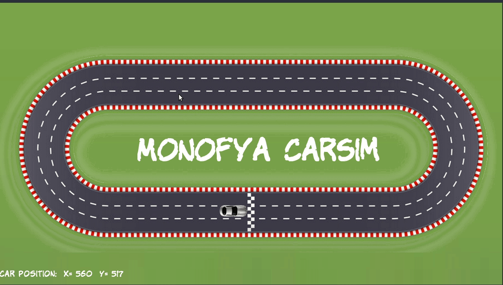

# Hema's CarSim V0.1
A Simple Car Simulator based on SFML Library and ROS for Udacity C++ NanoDegree Capstone Project. The Car can be steered both by the keyboard and ROS. You can also change the speed and reset the scene to the default state.

## Dependencies
* SFML Library   `sudo apt install libsfml-dev`
* [ROS](https://ros.org)

## How To Run:
* `cd build && cmake ..`
* `make`
* Launch a ROS master `$ roscore`
* `./CarSim`

## How to Drive Manually:
* Q -> Steer Left
* E -> Steer Right
* Arrow Up -> Increase Speed
* Backspace -> Reset

## How to Drive using ROS:
* Publish `std_msgs/Float32` on Topic `/CarSim/steer` values [-360,360]
* `$ rostopic pub /CarSim/steer std_msgs/Float32 "data: 5.0" `

## Project Structure:
* CarSim.cpp 
    * Program Main.
* Game.cpp / Game.h 
    * This Class is responsible for handling all the simulator logic from creating the Renderer, moving the Car in the Scene, handling user inputs from both the keyboard or ROS.
* Renderer.cpp / Renderer.h
    * This class is responsible for all the rendering done in the application using SFML library.
* Car.cpp / Car.h 
    * This class represent the car in the simulation. 
* graphics / fonts
    * the required graphics and fonts for the application.

